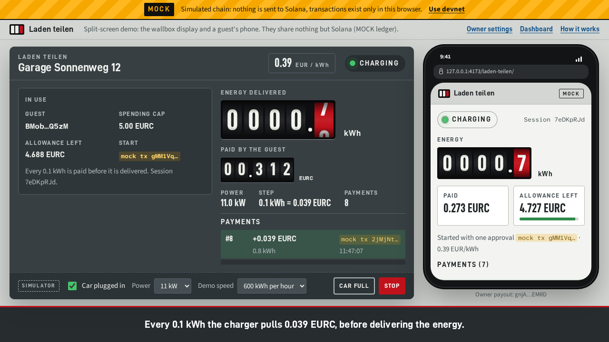
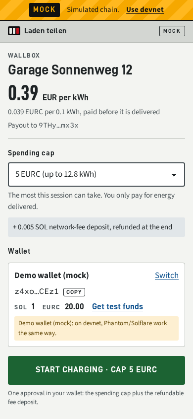
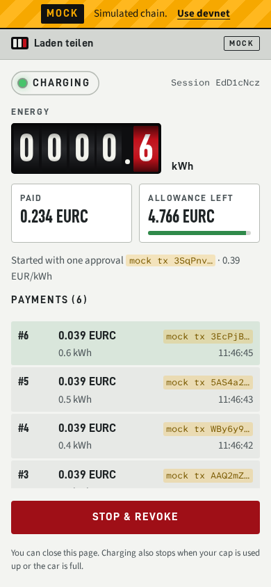
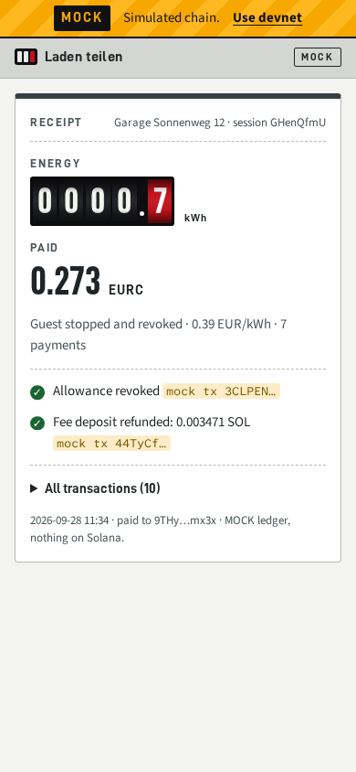
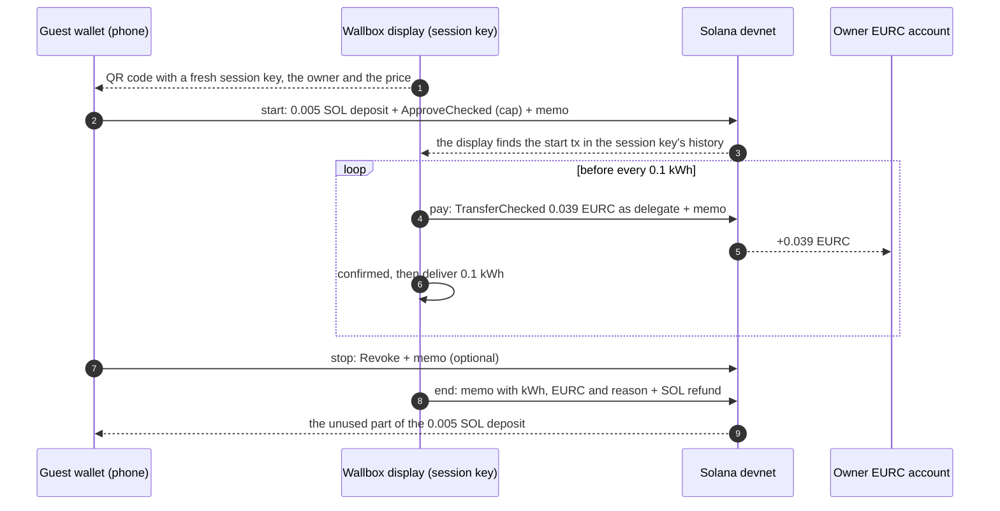

# Laden teilen

**Pay-as-you-charge for private wallboxes: EURC on Solana, settled every 0.1 kWh.**

Guests scan a QR code at the wallbox and approve one EURC spending cap. Before every 0.1 kWh, the charger pulls
0.039 EURC from their wallet, waits for the confirmation, then delivers the energy. No charging app, no sign-up,
no merchant account, no backend. (*Laden teilen* is German for "share charging".)

[](https://explorer.solana.com/?cluster=devnet)
[](https://explorer.solana.com/address/HzwqbKZw8HxMN6bF2yFZNrht3c2iXXzpKcFu7uBEDKtr?cluster=devnet)
[](#why-no-custom-program)
[](https://github.com/LyvorAlper/laden-teilen/actions/workflows/pages.yml)
[](LICENSE)

- **Live app:** https://lyvoralper.github.io/laden-teilen/
- **Split-screen demo** (wallbox display and guest phone on one page): https://lyvoralper.github.io/laden-teilen/#/demo
- **Video (2–3 min):** `TODO(video)`

> **Devnet prototype with a simulated charger. No real energy is sold and the tokens have no value.**
> Built for Superteam Germany's *Road to Colosseum: Build your MVP* and the Colosseum *Crypto World's Fair* hackathon.

<p align="center">
  
</p>
<p align="center">
  
  
  
</p>

<sub>Screenshots from the automated Playwright run in <b>MOCK mode</b> (yellow banner, simulated ledger, "mock tx"
labels instead of explorer links). The live site runs on Solana devnet by default; MOCK mode needs `?mock=1` in the
URL and always shows the banner.</sub>

## The problem

Many EV drivers in German cities park on the street and have no home charger, while private wallboxes sit idle
most of the day. Their owners would share with neighbours, visitors or holiday-rental guests, but getting paid
fairly is the blocker. Today that means cash, chasing PayPal transfers, or a billing subscription where the host
still sends the payment links.

Laden teilen is for **owners**, who get paid automatically per kWh without signing anything to set up, and for
**guests**, who pay only for the energy delivered, with a hard cap, and can walk away at any time.

## How it works

1. **Scan.** The display next to the wallbox (a tablet, an old phone, or the evcc bridge in a terminal) shows a
   QR code with a fresh key for this session only.
2. **Approve one cap.** One wallet approval: an EURC spending cap (for example 5 EURC) for that session key, plus a
   0.005 SOL network-fee deposit. The money stays in the guest's wallet.
3. **Pay, then charge.** Before every 0.1 kWh the display pulls one step (0.039 EURC at 0.39 EUR/kWh) and waits for
   the confirmation. Each payment is an on-chain receipt with a memo.
4. **Stop anytime.** *Stop & revoke* removes the approval. The display ends the session with a final memo and
   refunds the unused deposit. The guest paid exactly for the energy delivered.



**Trust model**

- **Pull before deliver.** The display is paid for each 0.1 kWh before it delivers it. With an honest wallbox the
  guest is never more than one step (about 0.04 EUR) ahead.
- **The cap is the worst case.** Like a card pre-authorisation: even a dishonest wallbox cannot take more than the
  approved cap, and the money stays in the guest's wallet until a step is pulled.
- **The guest can walk away.** Closing the tab changes nothing: the display bills only for energy it delivers,
  ends on its own when the cap or the funds run out or the car is full, and refunds the unused deposit. The guest
  can revoke at any time; the session key can neither revoke nor raise its own allowance.

## Solana integration

A session is four transaction types on standard programs only.

| Tx | Signed and paid by | Instructions |
|---|---|---|
| **start** | guest wallet | `System.transfer` 0.005 SOL guest → session key (fee deposit) · `Token.ApproveChecked` on the guest's EURC account, delegate = session key, amount = cap · `Memo` `LT1\|start\|…` |
| **pay #n** | session key | pay #1 only: `ATA.CreateIdempotent` for the owner's EURC account · `Token.TransferChecked` of one step, guest → owner, authority = session key as delegate · `Memo` `LT1\|pay\|…` |
| **stop** (optional) | guest wallet | `Token.Revoke` · `Memo` `LT1\|stop\|…` |
| **end** | session key | `Memo` `LT1\|end\|…` · `System.transfer` of the session key's entire remaining SOL back to the guest |

| Program | Address | Used for |
|---|---|---|
| System Program | `11111111111111111111111111111111` | SOL fee deposit (start) and refund (end) |
| SPL Token | `TokenkegQfeZyiNwAJbNbGKPFXCWuBvf9Ss623VQ5DA` | `ApproveChecked`, `TransferChecked`, `Revoke` |
| Associated Token Account | `ATokenGPvbdGVxr1b2hvZbsiqW5xWH25efTNsLJA8knL` | creates the owner's EURC account with the first payment |
| Memo v2 | `MemoSq4gqABAXKb96qnH8TysNcWxMyWCqXgDLGmfcHr` | `LT1` session memos, parsed by explorers |
| Circle EURC mint (devnet) | `HzwqbKZw8HxMN6bF2yFZNrht3c2iXXzpKcFu7uBEDKtr` | the payment token (classic SPL Token, 6 decimals) |

**Memo format** (one memo per transaction):

```text
LT1|start|<sid>|<priceMicroPerKWh>|<capMicro>
LT1|pay|<sid>|<n>|<whCumulative>|<stepMicro>
LT1|stop|<sid>
LT1|end|<sid>|<whTotal>|<totalMicro>|<reason>
```

- `sid` is the first 8 base58 characters of the session public key.
- Amounts are integers in micro-EURC (10⁻⁶). At 0.39 EUR/kWh the price is `390000` and one 100 Wh step is `39000`,
  that is 0.039 EURC. Example: `LT1|pay|Ab12Cd34|3|300|39000`.
- `reason` is one of `user`, `revoked`, `cap`, `funds`, `full`, `sol`, `error`.
- The RPC returns memos as `"[len] text"`; the decoder strips that prefix and ignores foreign memos.
- Memos are claims. The owner dashboard's *Verify* checks the real token balance changes of each payment
  (`getTransaction`, pre/post token balances).

### Why no custom program

The SPL Token delegate already is the primitive this needs: a capped pre-authorisation
([token program source](https://github.com/solana-program/token/blob/main/program/src/processor.rs)).

- `ApproveChecked` sets a delegate and an allowance. Every transfer by the delegate decrements the allowance, and
  the token program clears the delegate when it reaches 0.
- Only the account owner can `Revoke`. The delegate can neither revoke nor raise its own allowance.
- So "pull up to a cap" needs no escrow, no locked funds, and no program to write, audit, deploy or upgrade. The
  funds stay in the guest's wallet until each step is pulled.

### Why no backend

The chain is the message bus and the database.

- **Display and phone never talk directly.** The QR code carries the session public key. The display finds the
  guest's start tx with `getSignaturesForAddress(session key)` and validates it (delegate, mint, cap of at least one
  step, deposit, memo, price) before it pulls anything. The guest page follows the same history for the pay and end
  memos.
- **The owner dashboard is rebuilt from chain history** (`getSignaturesForAddress` on the owner's EURC account) on
  any device, even with empty storage: sessions, kWh, EUR, guests, explorer links and a CSV export.
- **No server at all.** A Solana Pay *transaction request* would need an HTTPS endpoint, and a *transfer request*
  cannot express `ApproveChecked` ([spec](https://docs.solanapay.com/spec)). So the guest page connects the wallet
  in the browser (wallet-standard), and the app is a static Vite build on GitHub Pages.
- **Keys.** There is no server key, no sponsor key and no long-lived key in the frontend. The display generates a
  fresh session key per session (`crypto.getRandomValues`), keeps it in `localStorage` only until the end tx, then
  wipes it. That key only ever holds the 0.005 SOL deposit and an allowance capped by the guest. The owner needs
  0 SOL and signs nothing to set up a wallbox.

### Implementation notes

- [`@solana/kit`](https://solana.com/docs/frontend) 8.3 with `@solana-program/token`, `memo` and `system`;
  wallet-standard discovery through `@solana/kit-plugin-wallet` and `@solana/react`.
- **Sign-only wallets.** The app asks the wallet for `solana:signTransaction` and broadcasts to devnet itself, so a
  wallet left on mainnet can never send the transaction to the wrong cluster.
- **No double charge.** Confirmation polls `getSignatureStatuses` and re-broadcasts the same signed bytes until the
  tx confirms or its blockhash expires. Only then is a pull rebuilt.
- **Public RPC friendly.** Reads that must see our own txs pass `minContextSlot`. A shared throttle keeps each tab at
  5 requests/s or less, with backoff on HTTP 429. `VITE_RPC_URL` switches to another RPC.
- **Why Solana.** A pull costs 5,000 lamports, so a 12.8 kWh session (128 pulls) costs about 0.00064 SOL in fees.
  The first payment to a new owner also pays the rent of the owner's EURC account (1,488,440 lamports, queried at
  runtime). The 0.005 SOL deposit covers all of it and the rest goes back to the guest. EURC settles in seconds,
  in euros.

## Deployment details (for judges)

| Item | Value |
|---|---|
| Cluster | Solana **devnet** (public RPC `https://api.devnet.solana.com`) |
| Token | Circle EURC, devnet mint [`HzwqbKZw8HxMN6bF2yFZNrht3c2iXXzpKcFu7uBEDKtr`](https://explorer.solana.com/address/HzwqbKZw8HxMN6bF2yFZNrht3c2iXXzpKcFu7uBEDKtr?cluster=devnet) (SPL Token, 6 decimals; [Circle's address list](https://developers.circle.com/stablecoins/eurc-contract-addresses)) |
| Programs | System `11111111111111111111111111111111` · SPL Token `TokenkegQfeZyiNwAJbNbGKPFXCWuBvf9Ss623VQ5DA` · Associated Token `ATokenGPvbdGVxr1b2hvZbsiqW5xWH25efTNsLJA8knL` · Memo v2 `MemoSq4gqABAXKb96qnH8TysNcWxMyWCqXgDLGmfcHr` |
| Custom programs | none deployed |
| Demo payout address | [`gnjANn6HJYbphXyT8fUkG4AUUNueykpzJ3VuWf1EMRD`](https://explorer.solana.com/address/gnjANn6HJYbphXyT8fUkG4AUUNueykpzJ3VuWf1EMRD?cluster=devnet), the public key of the devnet dev treasury and the default owner of `/#/demo` ([its dashboard](https://lyvoralper.github.io/laden-teilen/#/owner/dashboard?o=gnjANn6HJYbphXyT8fUkG4AUUNueykpzJ3VuWf1EMRD)) |
| Frontend | https://lyvoralper.github.io/laden-teilen/ (GitHub Pages, built by [`.github/workflows/pages.yml`](.github/workflows/pages.yml) from `main`) |

### Example transactions

> **`TODO(devnet-run)`**: these links are added after the funded devnet run (`npm run e2e:devnet` and
> `npm run bridge:devnet`). No signature is listed here until it exists on devnet.

| Step | Transaction |
|---|---|
| start (guest: SOL deposit + `ApproveChecked` + memo) | `TODO(devnet-run)` |
| pay #1 (session key: owner's EURC account + `TransferChecked` + memo) | `TODO(devnet-run)` |
| pay #2 | `TODO(devnet-run)` |
| stop (guest: `Revoke` + memo) | `TODO(devnet-run)` |
| end (session key: memo + SOL refund) | `TODO(devnet-run)` |
| owner payout account of that session | `TODO(devnet-run)` |
| evcc bridge session (pulls driven by evcc's metered energy) | `TODO(devnet-run)` |

What already ran against devnet without funds (`npm run e2e:devnet -- --smoke`, see
[docs/decisions.md](docs/decisions.md)): all four transaction types build, sign and pass devnet
`simulateTransaction`. The start tx, simulated for a real funded EURC holder, leaves the holder's token account with
delegate = session key and allowance = cap; the stop tx leaves no delegate; Memo v2 logs the `LT1` memo.

## Try it in 3 minutes

You need about 0.01 devnet SOL and 1 devnet EURC. Both faucets are free; getting the tokens is most of the 3 minutes.

1. Open the **split-screen demo**: https://lyvoralper.github.io/laden-teilen/#/demo. The wallbox display (left)
   shows a QR code for a fresh session key; the phone (right) "scans" it.
2. On the phone, tap **Use demo wallet (devnet)**. This is an in-page keypair, clearly labelled; Phantom and Solflare
   work the same way. The **Get test funds** panel opens with the wallet address and live balances.
3. Copy the address, then:
   - [faucet.solana.com](https://faucet.solana.com): choose **Devnet**, request 0.5 SOL (signing in with GitHub raises
     the limit).
   - [faucet.circle.com](https://faucet.circle.com): choose **EURC** and **Solana Devnet**, paste the address, send
     (no account needed; one request per address every couple of hours).
4. When both balances show "enough", pick a cap and tap **Start charging**. The display detects the start tx
   within seconds and pulls 0.039 EURC before every 0.1 kWh; at the default demo speed (1 kWh per minute) that is
   one payment about every 6 seconds, each with an explorer link.
5. Tap **Stop & revoke**. The receipt shows the kWh, the EURC paid, "Allowance revoked" and the refunded deposit.
6. Open **Dashboard** in the header: the owner's view, rebuilt from Solana history only.

**With your own wallet (Phantom):** Settings → Developer Settings → turn on **Testnet Mode** and choose
**Solana Devnet** ([Phantom docs](https://docs.phantom.com/developer-powertools/testnet-mode)), then fund the
address with the same two faucets. On desktop, choose *Connect wallet* in the phone frame instead of the demo
wallet. With a phone, open `/#/owner` on a laptop, enter a payout address that is not your guest wallet, open the
wallbox display, and scan its **"Phantom on your phone?"** QR code, which opens the guest page inside Phantom's
browser. The app only asks the wallet to sign; it sends the transaction to devnet itself.

## Real hardware: the evcc bridge

[`bridge/`](bridge) is a Node CLI that runs the same charger loop (`ChargerSession` from `src/core`) as the browser
display, but the energy comes from a real wallbox through [evcc](https://evcc.io), the popular open-source energy
manager, or through a go-e charger. The QR code is printed in the terminal.

- **Pull before deliver, one step ahead.** The bridge switches the evcc loadpoint to `now` only after pay #1 has
  confirmed. It then pulls the next step whenever evcc's metered `chargedEnergy` (Wh) comes within `--lead-wh` of
  the paid energy, and switches the loadpoint `off` when the session ends. The end memo carries the metered Wh.
- **Verified live against evcc 0.316.1** (28 Sep 2026): the `--demo` site in Docker, and a non-demo instance with a
  fixed-value demo charger (auth, API key). The smoke run passes nine checks, among them "metered ≤ paid while
  charging" (the paid energy stayed at least 79 Wh ahead of the meter) and "paid energy delivered before switching
  off". Details, curl transcripts and the full log: [docs/bridge.md](docs/bridge.md).
- **Not yet:** a physical wallbox (planned; the author installs them), go-e on hardware (implemented from the vendor
  API docs, unit-tested only), and the devnet bridge run, which waits for the funded treasury.
- **Safety.** The bridge is software only. It never touches wiring, contactors or the meter; it switches the charge
  mode through evcc's or go-e's API, exactly like the owner would in their app. Installing or modifying a wallbox is
  work for a qualified electrician.

Excerpt of the smoke run against the live evcc demo. It uses the in-memory chain, so transactions are labelled
`mock:`; with `--chain devnet` they are explorer links.

```text
$ npm run bridge:smoke
11:03:13  evcc 0.316.1 (demo mode) at http://127.0.0.1:7070 · evcc loadpoint 2 "Garage" · vehicle "white Model 3" · plugged in
11:03:17  guest 55orrw61... approved 0.117 EURC, deposit 0.005 SOL   mock:start
11:03:18  pay #1   0.039 EURC   paid 100 Wh   mock:pay#1
11:03:18  evcc loadpoint 2 "Garage": switched ON (POST /api/loadpoints/2/mode/now)
11:03:19  pay #2   0.039 EURC   paid 200 Wh   mock:pay#2
11:04:02  pay #3   0.039 EURC   paid 300 Wh   mock:pay#3
11:04:36  ending: cap (the guest's spending cap is used up)
11:05:03  evcc loadpoint 2 "Garage": switched OFF (POST /api/loadpoints/2/mode/off)
11:05:15  session ended: cap (the guest's spending cap is used up) · 3 payments · 0.117 EURC · metered 303.9 Wh · refund 0.00349156 SOL   mock:end
11:05:16  SMOKE: PASS
```

## Run locally

Node `^20.19.0` or `>=22.12.0`.

```bash
git clone https://github.com/LyvorAlper/laden-teilen.git
cd laden-teilen
npm ci
npm run dev        # http://localhost:5173/laden-teilen/ on devnet; add ?mock=1 for the in-browser MOCK ledger
npm test           # 74 app + 33 bridge unit tests (Vitest)
npm run build      # type-check and production build into dist/
npm run test:e2e   # 16 Playwright tests in MOCK mode against the production build
```

- `npm run test:e2e` needs a Chromium: `npx playwright install chromium`, or point `PW_CHROMIUM_PATH` at one.
  `PW_DEVNET=1` adds a read-only devnet test (no transactions, no faucets). `npm run test:e2e:screens` regenerates
  `docs/screens/`.
- Optional build variables: `VITE_RPC_URL` (another devnet RPC), `VITE_TOKEN=USDC` (devnet USDC instead of EURC),
  `VITE_DEMO_OWNER` (payout address of `/#/demo`). `VITE_MOCK_CHAIN=1` turns on MOCK mode on a dev server only,
  never in a production build.

**A full session on devnet from Node** (`scripts/e2e-session.ts`: start, 5 pulls, stop, end, then RPC assertions):

```bash
npm run e2e:devnet -- --smoke          # Kit checks against devnet, no funds needed
npm run e2e:devnet -- --init-treasury  # throwaway devnet treasury in .env.treasury (gitignored); prints the address
# fund that address by hand: faucet.solana.com (SOL) and faucet.circle.com (EURC, Solana Devnet)
npm run e2e:devnet                     # prints the explorer links of every transaction
```

The treasury key can also come from `DEV_TREASURY_SECRET` (a JSON array of 64 bytes, solana-keygen format). The
secret is never printed or committed. Devnet only.

**The evcc bridge:**

```bash
docker run --rm -d --name evcc-demo -p 7070:7070 evcc/evcc --demo   # evcc demo site
npm run bridge:smoke                                                # mock chain + live evcc, about 2 min
npm run bridge -- --charger sim --sim-speed 10 --poll-ms 500 --guest-cap 0.117 --guest-delay 1   # no Docker, about 13 s
npm run bridge:devnet                                               # real devnet txs, scripted guest from the treasury
npm run bridge -- --chain devnet --owner <payout wallet> --loadpoint 2 --name "Garage"   # a person scans the QR
npm run bridge -- --help
```

For a real evcc: `EVCC_URL`, `EVCC_LOADPOINT` and, if needed, `EVCC_API_KEY` (see [docs/bridge.md](docs/bridge.md)).

## Project structure

```text
src/core/        chain core shared by the web app, the scripts and the bridge
  config.ts        cluster, RPC, EURC mint, program IDs, session economics
  amounts.ts       bigint micro-EURC math
  memo.ts          LT1 memo codec
  chain.ts         @solana/kit client: start/pay/stop/end instructions, send + confirm, history readers
  session.ts       ChargerSession: the charger state machine (pull before deliver, stop triggers)
  throttle.ts      RPC rate limiter and retries
src/sim/         charger simulator and the in-browser MOCK ledger (tests and ?mock=1)
src/ui/          React UI
  pages/           landing, owner setup, owner dashboard, how it works, routes (display, guest, demo)
  kiosk/           wallbox display controller (one charger loop per browser)
  guest/           guest flow: wallet, cap, start, live meter, stop & revoke, receipt
  wallet/          wallet-standard (sign-only) and the demo wallet
  chain/           devnet adapter over src/core
scripts/         e2e-session.ts: a full devnet session from Node
bridge/          Node CLI for real wallboxes: evcc, go-e and simulator ports, terminal QR
e2e/             Playwright tests (MOCK mode, wallet-standard test double, opt-in read-only devnet test)
docs/            bridge.md (evcc verification), decisions.md, screens/
.github/         GitHub Pages workflow
```

## Security and limitations

- **One delegate per token account.** An SPL token account has a single delegate, and a new approval replaces the
  previous one. The guest page warns before it replaces another approval.
- **Leftover allowance.** When a session ends without the guest's *Stop & revoke* (display stop, car full, cap or
  funds used up), the unused allowance stays on the guest's EURC account until the guest revokes it or approves
  another delegate. The display wipes the session key, and the receipt shows "Allowance still active" with a
  *Revoke now* button. A dishonest display that kept the key could pull up to that leftover, which is why the cap is
  the worst case.
- **Owner is not guest.** Paying yourself is an SPL self-transfer, which never uses up the allowance. The guest page
  refuses the payout wallet, and the display ends such a session at once and refunds the deposit.
- **QR tampering ("quishing").** A swapped sticker could send payments to someone else. The guest page shows the
  payout address with an explorer link before any approval. Roadmap: an owner-signed on-chain charger registry.
- **The display must stay online.** It is the side that pulls payments. After a reload it resumes the session from
  the chain without pulling a step twice, or ends it and refunds the deposit. If its storage is wiped mid-session,
  the deposit on the session key (at most 0.005 SOL) cannot be refunded; the guest's EURC stays limited by the cap
  and can be revoked.
- **Memos are claims.** Anyone can write an `LT1` memo; *Verify* on the dashboard checks the real token movement.
- **Demo wallet.** An in-page keypair in `localStorage`, devnet only, labelled as such. Never send real funds to it.
- **Wallet previews.** The wallet-standard path (connect, sign-only start, stop & revoke) is covered by a Playwright
  test double. How Phantom, Solflare and Backpack preview `ApproveChecked` on devnet has not been checked in a
  recorded run yet.
- **Public RPC.** Devnet's public RPC allows 100 requests per 10 s per IP. The throttle stays below that, but a busy
  demo can still see retried HTTP 429s.
- **Devnet only.** The EURC mint has the same address on mainnet, so the config always pairs the mint with the
  cluster. The simulator is not a meter. Do not point this code at mainnet.

## Eichrecht (German metering law)

*Not legal advice.*

- **Devnet prototype with a simulated charger. No real energy is sold and the tokens have no value.**
- Pricing is per kWh on purpose, because kWh is the unit German metering law expects.
- Production requires an eichrechtskonforme (metering-law compliant) wallbox: a MID meter plus a signed meter-value
  chain. A MID meter alone is not enough.
- Selling wallbox energy per kWh to neighbours or guests is very likely commercial use under
  [§ 33 MessEG](https://www.buzer.de/33_MessEG.htm), and the [ADAC](https://www.adac.de/fahrzeugwelt/wallbox/eichrechtskonform/)
  lists use by neighbours and acquaintances as a case where a compliant wallbox can be needed. Flat or time-based
  pricing is not a way around this: the [Eichamt Sachsen](https://www.eichamt.sachsen.de/elektromobilitaet.html)
  states that neither flat-rate billing nor billing by parking time is permitted, and that only wallboxes for purely
  private use are exempt.
- **Roadmap:** anchor each signed meter reading (OCMF payload hash) in the pay memo. That gives a public,
  tamper-evident receipt that the guest can check with the PTB-approved transparency software.
- Not checked yet: whether pure cost sharing between neighbours falls outside commercial use, and price-labelling,
  charging-station, electricity-tax and trade-registration rules.

## Competitive landscape

> DeCharge sells chargers. Stromnachbar sends PayPal links. Laden teilen turns the wallbox you already own into a
> pay-per-kWh charger with one QR code and one wallet approval, settled in EURC every 0.1 kWh.

| Project | What it is | How Laden teilen differs |
|---|---|---|
| [DeCharge](https://solanacompass.com/projects/decharge) | Solana EV-charging DePIN with its own charger hardware and USDC/USDT payments; 2nd in the DePIN track of Colosseum's [Renaissance hackathon](https://blog.colosseum.com/announcing-the-winners-of-the-solana-renaissance-hackathon/) (2024). | Software only, for the wallbox you already own (via evcc); euro-first with EURC; no platform custody; pay per 0.1 kWh against a cap. |
| [DeCharge × Wallbox](https://theevreport.com/decharge-and-wallbox-partner-to-deploy-peer-to-peer-ev-charging-network) (Dec 2025) | Peer-to-peer home-charger sharing in the US on Wallbox Pulsar Plus hardware. The announcement does not describe the payment flow. | Germany-first: EURC, an Eichrecht roadmap, and evcc, the German open-source energy manager. |
| [Share&Charge](https://medium.com/ursium-blog/share-charge-launches-its-app-on-boards-over-1-000-charging-stations-on-the-blockchain-ba8275390309) (innogy, 2017) | Peer-to-peer charging at private stations on Ethereum in Germany, over 1,000 stations at launch. Current status unknown. | 2017 fees ruled out per-step settlement, and it needed an app. Here a browser, a stablecoin and any wallet-standard wallet are enough. |
| [Stromnachbar](https://stromnachbar.de/wallbox-abrechnung/) | Wallbox sharing for neighbours without crypto. The billing plan costs 59 EUR a year and does not process payments: hosts share PayPal or bank details. | Settlement is the product: instant, no chasing, no subscription, receipts on-chain. |

## Roadmap to Colosseum

- **Real hardware.** Run the evcc bridge on a physical wallbox and test go-e on hardware; publish the devnet bridge
  session.
- **Eichrecht-grade receipts.** Anchor each signed meter value (OCMF payload hash) in the pay memo, so a guest can
  check every billed kWh against the meter's signature.
- **Owner-signed charger registry.** The guest page checks on-chain that a QR code's payout address belongs to a
  registered charger, which stops swapped stickers.
- **Solana Pay transaction-request endpoint.** Any Solana Pay wallet could start a session straight from the QR code.
  This needs a small HTTPS endpoint, the only server in the design.
- **Mainnet EURC.** The owner creates the EURC account once at onboarding (so guests never pay that rent), and the
  step size becomes configurable (0.5–1 kWh on mainnet keeps fees negligible).
- **Multi-unit buildings (WEG).** Shared garages in apartment buildings: one display per bay, per-unit billing and
  bookkeeping exports.
- **Business model.** A small per-kWh protocol fee on mainnet, plus a paid "Pro" tier for multi-unit buildings with
  bookkeeping exports.

## Development history

- **Built during the contest.** The repository was created on 28 Sep 2026 (first commit 09:51 UTC), during the
  Colosseum contest period that started on 14 Sep 2026. There is no prior code: everything here was written in this
  period, and the commit history is the development log.
- **Who and how.** Built by Alper ([@LyvorAlper](https://github.com/LyvorAlper)), an apprentice electrician
  (Elektroniker für Energie- und Gebäudetechnik) who installs wallboxes, with
  [Claude Code](https://claude.com/claude-code) as the coding agent. Commits made with Claude Code carry a
  `Co-Authored-By: Claude` trailer.
- **Open-source dependencies** are listed in [`package.json`](package.json): the Solana Kit and program clients,
  React, qrcode, Vite, Vitest, Playwright and Fontsource fonts. The D-DIN font is bundled under the SIL Open Font
  License.
- **Precedents** are named openly under [Competitive landscape](#competitive-landscape).

## License

[MIT](LICENSE) © 2026 LyvorAlper. Fonts keep their own licenses: D-DIN © 2017 Datto Inc., SIL OFL 1.1
([src/ui/assets/fonts/d-din/OFL-1.1.txt](src/ui/assets/fonts/d-din/OFL-1.1.txt)); Source Sans 3 and Atkinson
Hyperlegible Mono via Fontsource, SIL OFL 1.1.
